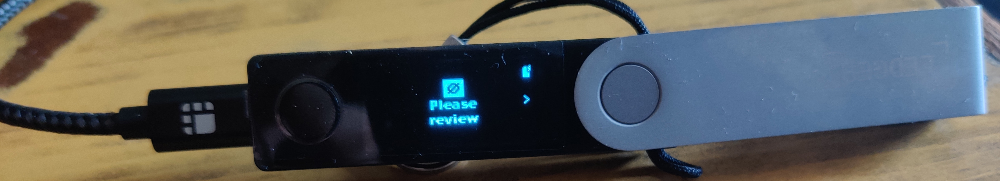
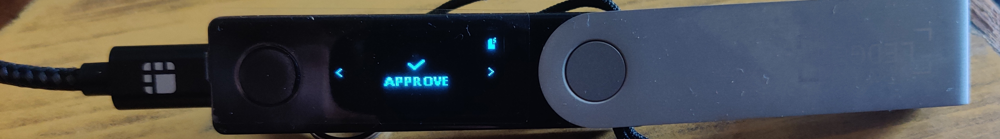

# Generating address for Quicksilver Network
This guide will help you generate an address for the Quicksilver network using terminal (command line). It is a very easy guide to follow so anyone with access to Git and a terminal can do this.

## Requirements
1. Git
2. Golang (installed on your system)

## 1. Build Quicksilver CLI tool
This step expects that the user already has Git and Golang installed. Mac users can use Homebrew to install these.

```
$ git clone https://github.com/ingenuity-build/quicksilver.git
$ cd quicksilver
$ git checkout tags/v0.3.0
$ make build
$ cd build
```


Upon listing the contents of the build directory you should see the `quicksilverd` executable. This is what we will use next to generate our address.

## 2. Generating address using Ledger
This step assumed you have a ledger device connected via USB to your machine. Make sure the Cosmos app is installed and open on Ledger before you perform this step. When you run the following command you will be asked to review the transaction on Ledger. Hit `Approve` once you have reviewed all the fields on Ledger.

```
$ ./quicksilverd keys add my-key-name --ledger 


- name: my-key-name
  type: ledger
  address: quick15q94h723t1v444q2po10iurfkgq659lnzdcp35
  pubkey: '{"@type":"/cosmos.crypto.secp256k1.PubKey","key":"Wi1ZloQklTNwBPEbxj0GEnMivbdTiPo85jo+1qL34sxV"}'
  mnemonic: ""
```





## 3. Generating address using an old mnemonic
This step is for those users who do not possess a Ledger or want to generate a Quicksilver address from their raw mnemonic. 


> _The mnemonic shown below is a random one and doesn't correspond to any real address. It is just used for illustration purposes_

```
$ ./quicksilverd keys add my-key-name --interactive
> Enter your bip39 mnemonic, or hit enter to generate one.
ice dwarf wonder woman moriarty rubber ship cosmos rack hurt idea drop zintec mule strange ironman flash power thanos stick zoomcar nordic half fango
> Enter your bip39 passphrase. This is combined with the mnemonic to derive the seed. Most users should just hit enter to use the default, ""


- name: my-key-old-mnemomic
  type: local
  address: quick1dfgtqrxqeuf9po4prarewjlam2a9nrjty54xae
  pubkey: '{"@type":"/cosmos.crypto.secp256k1.PubKey","key":"Dk22D0qtilaKQEmeTxrjXXowoy753v8HupMJtJmAcW52"}'
  mnemonic: ""


**Important** write this mnemonic phrase in a safe place.
It is the only way to recover your account if you ever forget your password.

ice dwarf wonder woman moriarty rubber ship cosmos rack hurt idea drop zintec mule strange ironman flash power thanos stick zoomcar nordic half fango
```

## 4. Generating address using a new mnemonic
This step is for those users who want to generate a paperwallet and a quicksilver address from scratch. In this step you will generate a 24-word mnemonic. 

> **Note:** You must BACK UP this mnemonic in a safe place. This is going to be your only way to access your funds. **If you loose this, you loose access to your funds!** Anyone in posession of this mnemonic can steal your funds!

```
$ ./quicksilverd keys add my-key-new-mnemomic

- name: my-key-new-mnemomic
  type: local
  address: quick1wel9cittgvpo23fumg5cchgmv8tlm9l2ginesh
  pubkey: '{"@type":"/cosmos.crypto.secp256k1.PubKey","key":"Jpiter8s/z5nR/M63wAZ8ZaQ+Nhsahasgh/ADf3HEz0Z"}'
  mnemonic: ""


**Important** write this mnemonic phrase in a safe place.
It is the only way to recover your account if you ever forget your password.

word1 word2 word3 word4 soon allword some word could drink plastic target indoor material city need file zone lambo greece town never goat arrest
```

<br>

---

Voila! You have your quicksilver address now. You are ready to experience liquid staking on Cosmos SDK networks!

