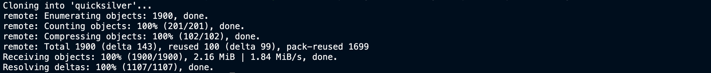
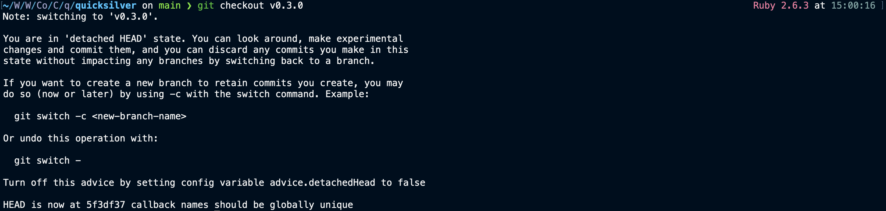

# Generating address for Quicksilver Network
This guide will help you generate an address for the Quicksilver network using terminal (command line). It is a very easy guide to follow so anyone with access to Git and a terminal can do this.

## Requirements
1. Git
2. Golang (installed on your system)

## 1. Build Quicksilver CLI tool
This step expects that the user already has Git and Golang installed. Mac users can use Homebrew to install these.

```
$ git clone https://github.com/ingenuity-build/quicksilver.git
$ cd quicksilver
$ git checkout tags/v0.3.0
$ make build
$ cd build
```



Upon listing the contents of the build directory you should see the `quicksilverd` executable. This is what we will use next to generate our address.

## 2. Generating address using Ledger
This step assumed you have a ledger device connected via USB to your machine. Make sure the Cosmos app is installed and open on Ledger before you perform this step. When you run the following command you will be asked to review the transaction on Ledger. Hit `Approve` once you have reviewed all the fields on Ledger.

```
$ ./quicksilverd keys add my-key-name --ledger 


- name: my-key-name
  type: ledger
  address: quick15q94h723t1v444q2po10iurfkgq659lnzdcp35
  pubkey: '{"@type":"/cosmos.crypto.secp256k1.PubKey","key":"Wi1ZloQklTNwBPEbxj0GEnMivbdTiPo85jo+1qL34sxV"}'
  mnemonic: ""
```


